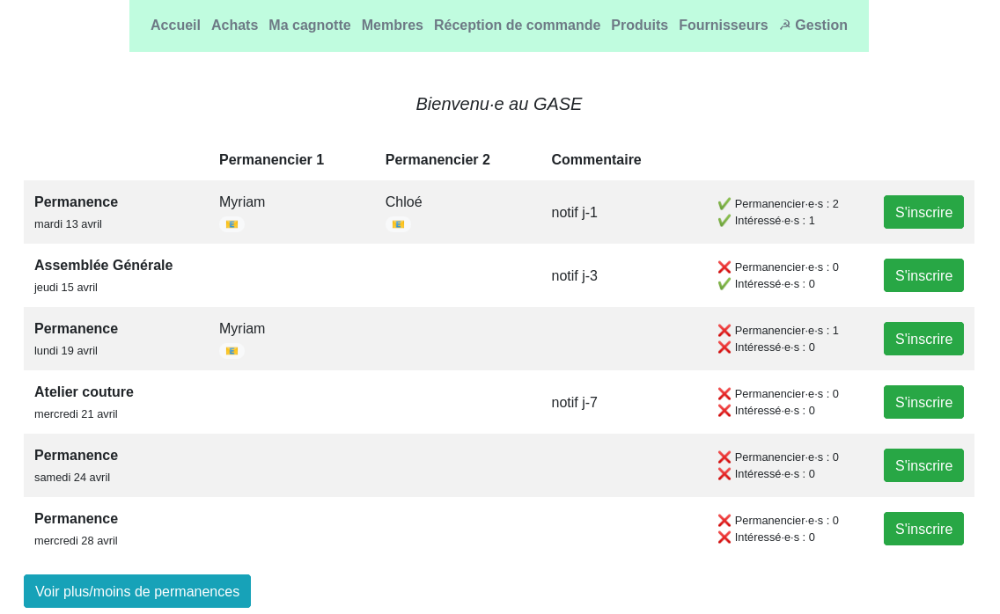
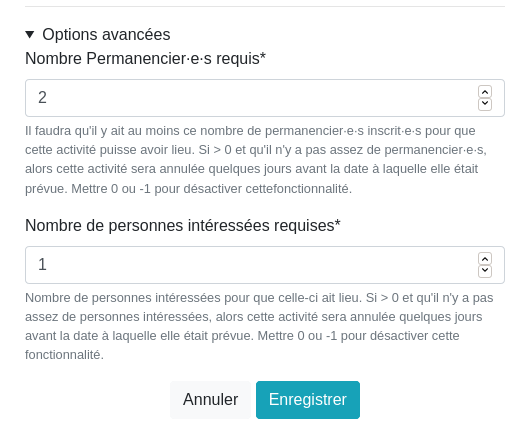

# Le Compteur du Gase (CdG)
*Logiciel pour gérer une épicerie autogéreé !*

## Présentation

Le Compteur du Gase Gestion permet de gérer les comptes et stocks d'un GASE (Groupement d'Achat en Service Épicerie, une épicerie autogérée).
Le logiciel est pensé pour les groupements d’achats / épiceries fonctionnant de la façon suivante :
    • Chaque adhérent a un compte qu’il crédite.
    • Quand on fait des courses, on entre dans le logiciel ce que l’on achète (à la manière d’un logiciel de caisse) et cela débite notre compte en conséquence.
    • Le logicel met aussi à jour les stocks et propose un suivi de ceux-ci.
Il permet de gérer les stocks, les comptes des adhérents et la liste des adhérents.

## Historique

Depuis quelques années, les trois GASEs (des épiceries autogérées) de Nantes utilisent le logiciel ([MoneyCoop](https://github.com/barchstien/gase-web)).
Le Compteur du GASE est une réécriture du logiciel MoneyCoop pour en refaire une version plus moderne, plus pratique, avec de
superbes statistiques et avec un meilleur nom !

MoneyCoop a été écrit en ~ 2012 par Pascal L. pour l'épicerie l'indépendante à Paris 18ème.
Cette épicerie consistait deux gros placards au fond d'une salle de réunion et une permanence par semaine.
Au début, les comptes étaient fait avec une feuille Excel mais ça c'est rapidement révélé ingérable.
Comme ils avaient peu de temps le logiciel était en ligne et chacun enregistrait ses achats chez soi, de sorte de consacrer tout le temps des permanences à l'échange, et à l'organisation (commandes).
L'indépendante a été influencée par le GASE de Rochefort en Terre. Puis d'autres groupement on demandé les sources de MoneyCoop pour l'utiliser, notamment à Nantes via une personne qui était à l'indépendante avant, à Champigny...
Deux principes ont guidé l'écriture du logiciel : "tout le monde doit pouvoir tout faire" (même mot de passe pour tous), "simple et robuste" (par exemple pas possible de supprimer des choses pour éviter les erreurs).

Il n'y avait pas de statistiques dans la version de base, cela a probablement été rajouté par les Nantais.

Version de démo ici : https://demo-compteur.gase.eu.org

## Configuration

Ce logiciel peut être utilié tel quel.

Néanmoins, pour personnaliser l'interface graphique, il faut créer un fichier local.css dans le répertoire contenant le fichier base.css.

Différentes options sont également disponibles dans l'interface graphique dans Gestion>Interface d'administration>Réglages divers.

## Contributions

Toutes les remarques et contributions sont les bienvenues. N'hésitez pas à entrer en contact avec moi si vous souhaitez l'installer dans votre épicerie.

Pour le développement, des détails techniques sont disponibles dans le fichier [HACKING.md](./HACKING.md)

Contact : jojo144@girole.fr

## Installation

Deux façons d'installer le logiciel : soit en local sur Debian/Ubuntu, soit en ligne avec [Yunohost](https://yunohost.org).

Le compteur du GASE est une application écrite en [Django](https://www.djangoproject.com/), un framework Python pour écrire des applications web.
Dans les deux cas il sagit donc d'installer un serveur web (Nginx) et de faire tourner Gunicorn.

### Installation en local

Testé sur Ubuntu 19.04. Il suffit d'éxecuter le script `local_install.sh` qui fait tout ce qu'il faut.
```
sudo apt-get install python3-venv nginx
sudo mkdir /opt/compteur_gase
cd /opt/compteur_gase
sudo git clone https://github.com/Jojo144/compteur_du_gase
# personaliser les variables dans local_install.sh
sudo compteur_du_gase/local_install.sh
```
Ensuite le logiciel est accessible sur http://localhost .
Tester aussi de redémarrer pour voir si les services se lancent bien tous seuls.

Vous pouvez choisir un autre répertoire que `/opt/compteur_gase` ça devrait marcher.
Il y a des *warnings* à propos du cache pip, je les ai ignoré pour le moment.

Attention, si vous tombez sur une page Apache "It works" c'est que vous avez Apache d'installé au lieu de Nginx (ou les deux).

### Installation en ligne

Paquet Yunohost.
```
sudo yunohost app install https://github.com/Jojo144/compteur_du_gase
```
Pour le moment seuls les scripts `install`, `upgrade` `remove` fonctionne.

Pour mettre à jour :
```
sudo yunohost app upgrade compteur_gase -u https://github.com/Jojo144/compteur_du_gase
```

### Après l'installation (quel que soit le mode d'installation)

À la première utilisation il faut aller dans l'interface administration pour 

- créer des unités (en général : kg, L, bouteille, sachet, pot) et des catégories (par ex :
Légumineuses, Conserves, Non alimentaire, ...).
- réaliser divers paramétrages (désactiver les fonctionalités non utilisées, paramétrer l'envoi d'email… etc).

Puis c'est parti !

Pensez ensuite à mettre en place une sauvegarde.

##### Exemples d'unités

|           | Vrac | Pluriel |
|-----------|------|---------|
| unité     |  0   |    0    |
| kg        |  1   |    0    |
| L         |  1   |    0    |
| tablette  |  0   |    1    |
| sachet    |  0   |    1    |
| bouteille |  0   |    1    |
| pot       |  0   |    1    |


## Sauvegarde de la base de donnée

Il faut sauvegarder le fichier `db.sqlite3` qui se trouve là où est installée votre application
(dans `/opt/compteur_gase` par exemple).


## Mise à jour

Au début je sais plus et après :

`sudo -u compteur_gase venv/bin/python3 manage.py migrate`


## Migration depuis gase-web et Mysql

J'ai écrit un script qui permet de migrer les données de MoneyCoop / gase-web (base de donnée Mysql) vers le CdG.

Nécessite le paquet `mysql-connector-python` et `ipython` pour le `%run`. Dans le venv :
```
pip install mysql-connector-python ipyhton
```
Puis `./manage.py shell` et dans ce shell Django :
```
%run migration.py
```

## Export de certaines tables

Il est possibles d'exporter certaines tables :
```
manage.py export_products /path/to/filename.xlsx
manage.py export_providers /path/to/filename.xlsx
manage.py export_households /path/to/filename.xlsx
```

## Credits

- Favicon made by Freepik from www.flaticon.com
- Bootstrap4 Select2 theme CSS is from [BootStrap4 Select2 theme 1.3.2](https://github.com/ttskch/select2-bootstrap4-theme)

## Configuration

## Envoi d'email

| Variable                         | Label dans l'admin                                                                                          | Description                                                                                                  |
| -------------------------------- | ----------------------------------------------------------------------------------------------------------- | ------------------------------------------------------------------------------------------------------------ |
| prefix_object_mail               | Préfixe dans l'objet des emails.                                                                            | Ajoute un prefixe dans le sujet des mails, par exemple "[GASE]"                                              |
| mail_host                        | Serveur pour l'envoi des mails. « localhost » pour utiliser le serveur du compteur comme serveur d'envoi.   | Nom d'hôte du serveur SMTP que le Compteur utilisera pour envoyer des emails                                 |
| mail_port                        | Port smtp pour l'envoi des mails.                                                                           |                                                                                                              |
| mail_from                        | Expéditeur pour l'envoi des mails.                                                                          | Adresse email affichée en "From" dans les emails envoyés par le Compteur                                     |
| mail_username                    | Nom d'utilisateur pour l'envoi des mails.                                                                   | Nom d'utilisateur utilisé par le Compteur pour s'authentifier auprès du serveur SMTP                         |
| mail_passwd                      | Mot de passe pour l'envoi des mails.                                                                        | Mot de passe utilisé par le Compteur pour s'authentifier auprès du serveur SMTP                              |
| mail_protocole                   | Chiffrement utilisé pour l'envoi de mails.                                                                  | Définit si la connexion entre le Compteur et le serveur est Chiffrée (TLS ou SSL) ou non chiffrée            |
| mail_timeout                     | Timeout pour l'envoi de mail.                                                                               | Définit la patience qu'aura le Compteur pour échanger avec le serveur SMTP avant d'abandonner (en secondes)  |
| mail_mailinglist_address         | Adresse de la mailing list du gase                                                                          | Adresse mail de la mailing list de l'épicerie (pour envoyer le même courriel à tous les membres)             |                                                                                                             |

### Gestion automatisée de la planification des activités de l'épicerie

Le compteur permet de gérer les activités de l'épicerie. Par activité on entend, par exemple, une permanence, une
assemblée générale, une distribution, etc.



Pour activer cette fonctionnalité, vous devez paramétrer `use_activity_reminders` à `True` (cochez la case `Utilisation de la fonction de relance pour les activités ?` dans `admin > Réglages divers > Réglages divers`).

Le compteur peut aussi gérer les relances par email s'il n'y a pas assez de participants inscrit·es :
* un email est envoyé 7 jours avant l'activité pour annoncer que les inscriptions sont ouvertes
* un email de relance est envoyé 3 jours avant la date de l'activité pour inciter les gens à s'inscrire
  
La veille de la date de l'activité, le compteur vérifie que l'activité peut avoir lieu en vérifiant le nombre
de volontaires inscrit·es pour tenir l'activité et le nombre de membres intéressé·es par l'activité.
S'il y a assez de personnes inscrites, l'activité est confirmée. Dans le cas contraire, le compteur marque
automatiquement l'activité comme annulée. Dans ces deux cas un email est envoyé pour indiquer aux membres de l'épicerie
ce qu'il en est.
Le nombre d'inscrit·es requis est paramétrable dans les `Options avancées` de chaque activité :



Pour cette fonctionnalité, les variables de configuration suivantes sont intéressantes (en plus de celles concernant l'envoi d'email, bien sûr) :

| Variable                         | Label dans l'admin                                             | Description                                                                                |
| -------------------------------- | -------------------------------------------------------------- | ------------------------------------------------------------------------------------------ |
| activity_board                   | Utiliser le tableau des permanences ?                          | Activer la gestion des activités dans le Compteur.                                         |
| use_activity_reminders           | Utilisation de la fonction de relance pour les activités ?     | Activer les relances par email et la gestion automatique des activités par le Compteur.    | 
| mail_mailinglist_address         | Adresse de la mailing list du gase ?                           | Email où seront envoyées les relances                                                      |

Pour envoyer les emails, des templates sont utilisés.
Il y a des templates pour le sujet des emails :
* `base/templates/base/mail_activity_01_subscribing_is_open_subject.txt`
* `base/templates/base/mail_activity_02_not_enough_participants_subject.txt`
* `base/templates/base/mail_activity_03_confirm_or_cancel_activity_subject.txt`
  
Et des templates pour le corps des emails
* `base/templates/base/mail_activity_01_subscribing_is_open.txt`
* `base/templates/base/mail_activity_02_not_enough_participants.txt`
* `base/templates/base/mail_activity_03_confirm_or_cancel_activity.txt`

Enfin, vous devez créer la tâche planifiée (les tâches sont gérées par [Django-Q](https://django-q.readthedocs.io/)) :
```bash
python manage.py install_scheduled_tasks
```

Cette tâche planifiée sera exécutée tous les matins à 2:00.